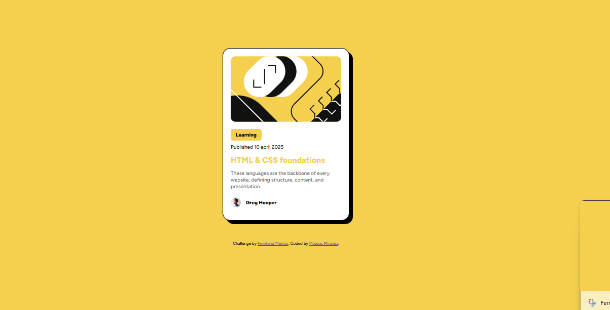

# Frontend Mentor - Blog preview card solution

This is a solution to the [Blog preview card challenge on Frontend Mentor](https://www.frontendmentor.io/learning-paths/getting-started-on-frontend-mentor-XJhRWRREZd/steps/67c0e40d8e9721b35e40a5cd/challenge/start). Frontend Mentor challenges help you improve your coding skills by building realistic projects.

## 📸 Screenshot

## 🚀 Live Demo

This project was published using GitHub Pages.  
Check it out here 👉 [Click here to view the live project](https://mateusmiranda.github.io/blog-preview-card)

---

## 🛠️ Built with

- Semantic **HTML5**
- **CSS3** (custom properties)
- **Flexbox**
- **Responsive Design** with media queries
- **@font-face** for custom fonts (Figtree)
- **Mobile-first workflow**

---

## 🔧 What I learned

- How to build a simple card layout using only HTML and CSS.
- How to use `@font-face` to load and apply local fonts.
- How to add responsiveness without changing the fixed container width.
- Improved understanding of spacing, shadows, and layout structure.

---

## 👨‍💻 Author

- Frontend Mentor – [@mateussmiranda](https://www.frontendmentor.io/profile/mateussmiranda)
- GitHub – [@mateusssmiranda](https://github.com/mateussmiranda)
- Developed by: **Mateus Miranda**

---

## 🙏 Acknowledgments

Challenge by [Frontend Mentor](https://www.frontendmentor.io?ref=challenge).
 
Coded with ❤️ by Mateus Miranda.
